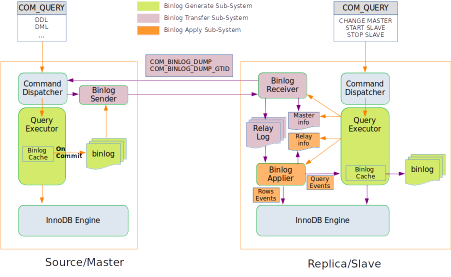

# MySQL 复制

## 基本架构

Master上存放的是binlog，传输到slave上存放的是relaylog，slave上进行重放后会写自己的binlog。

## Binlog Generate Subsystem
### Binlog Format
- Statement Format
- Row Format
- Mixed Format

Statement Format记录的是完整的是完整的语句，是一个Query_event，以及用到的变量等环境信息。但是不能保证安全，因为可能存在`INSERT ... SELECT ... LIMIT 10;`的语句，还有随机函数`RAND()`的存在。

Row Format记录的是完整的数据，可以直接通过引擎的接口进行写入，不用执行SQL。
- Rows\_update\_event
  UPDATE语句产生的行数据
  Before Image: 旧数据
  After Image: 新数据

- Rows\_write\_event
  INSERT语句产生的行数据
  只需要After Image的数据

- Rows\_delete\_event
  DELETE产生的数据
  只需要Before Image的数据

- Table\_map\_event
  记录Rows_event的表的元数据信息

- Query\_event
  DDL仍然记录Query_event

Row Format与Statement Format的比较：
- Statement Format不能保证安全，Row Format可以
- Statement Format占用空间小，Row Format占用空间大
- Row Format Apply不经过Executor，效率更高。
- 主流的使用模式Row Format

Mixed Format就是结合两者的优缺点，将能够产生稳定结果的使用Statement Format，不能产生稳定结果的使用Row Format，但是仍然存在一些问题，用的比较少。
