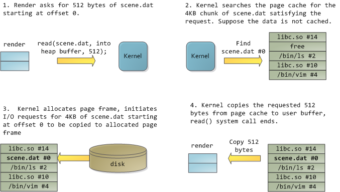
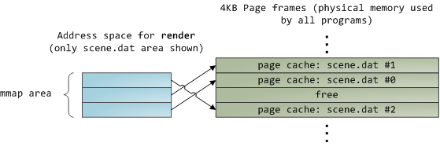
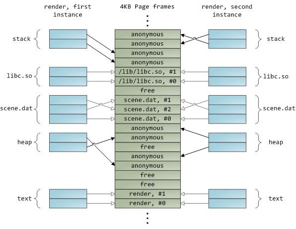

# Page Cache

Linux 会尽量将读取过的文件内容缓存在物理内存中，叫做 Page Cache，这样程序下一次访问文件时，就会直接去 Page Cache 中获取，相当于内存访问操作。Page size 默认是 4KB。
```bash
$getconf PAGE_SIZE
4096
```

通过`vmtouch`命令可以观测某个文件内容的缓存状态，比如有 partsupp.tbl 文件：

```bash
# 通过 dd 命令进行拷贝，前两行的数字代表读取/写入 bs 的次数，默认一次 512 bytes
$dd if=partsupp.tbl of=/dev/null
232391+1 records in
232391+1 records out
118984616 bytes (119 MB) copied, 0.367606 s, 324 MB/s

# 此时文件内容全部缓存到 Page Cache 里
$vmtouch partsupp.tbl
           Files: 1
     Directories: 0
  Resident Pages: 29049/29049  113M/113M  100%
         Elapsed: 0.003718 seconds

# 选项 -e 可擦除
$vmtouch partsupp.tbl -e
           Files: 1
     Directories: 0
   Evicted Pages: 29049 (113M)
         Elapsed: 0.00905 seconds
```

## 读写文件时 Page Cache 发挥的作用

### 非内存映射文件读

应用程序使用`read()`函数读取 512 字节时，发现内存不在缓存中，会产生缺页中断（Page Fault），Linux 会处理异常，将需要的 Page 读取到物理内存（Page Cache）中，然后用户从页缓存拷贝到提前申请好的 buffer 中。这个过程涉及两次数据拷贝，物理内存中存在两份数据，而且处于用户应用程序的 buffer 是无法被其他应用程序访问的。



读取 12KB 内容的内存状态如下（anonymous 内存为用户使用 malloc 分配的)：


### 内存映射文件（mmap）

内存映射文件可以将程序的虚拟页面映射到 Page Cache 上，可以避免用户缓冲区的内存分配和内容拷贝，多个进程可以共用和映射同一块 Page Cache，能够提升文件访问性能。当映射一个文件时，并不是一次性将全部内容映射到内存中，也是通过 Page Fault 来按需映射的，因此第一次访问不在缓存中的文件时，会涉及磁盘 IO。



### 写文件过程，Copy On Write

当应用向文件中写入内容时，并不是直接将内容写入到磁盘文件，而是将用户缓冲区的修改内容拷贝到 Page Cache 中，并将这个页面标记为脏页，磁盘 I/O 并不会立即发生，而是由内核决定。

多个应用在访问同一个文件时，只有当发生写入时，才会拷贝一份新的到匿名内存区域，并完成修改。


### 动态加载库

是通过文件映射融入到你的程序的地址空间中的，与内存映射文件的效果类似，多个程序可以共享同一个动态链接库。



